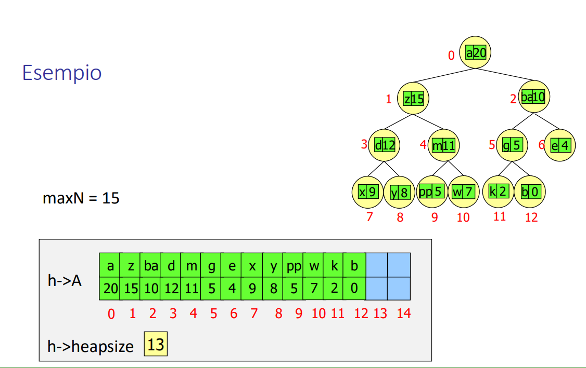

**HEAP**

Definizione: albero binario con
-   proprietà strutturale: completo a sinistra (tutti i livelli
completi, tranne eventualmente l’ultimo, riempito da SX aDX)  bilanciato
Conseguenza: chiave max nella radice
Implementazione: mediante vettore