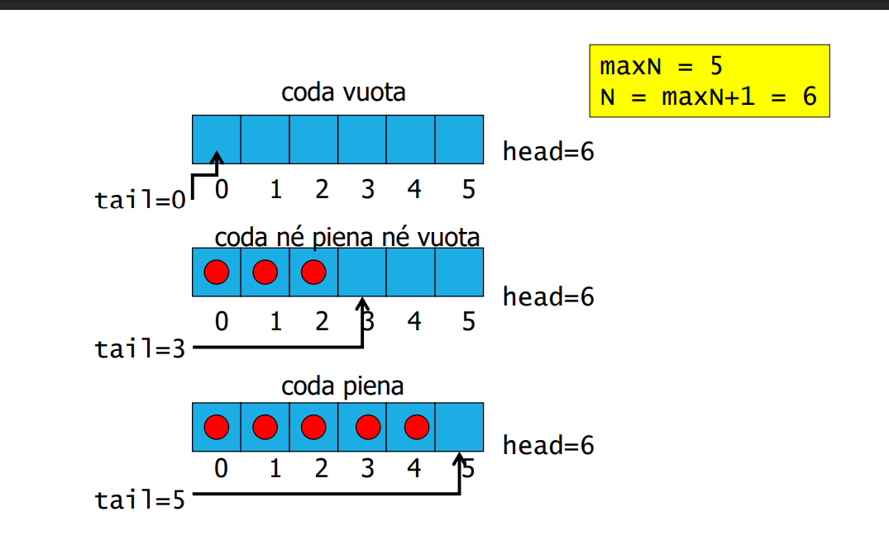

**Queue**

Implementazioni

**Lista** (Peggio)
Lista linkata, usa 2 puntatori
Dimensione dinamica della coda
Usa memoria extra

**Vettore** (Meglio)
Usa circular array
Buone prestazioni
PErò coda di dimensione fissa
