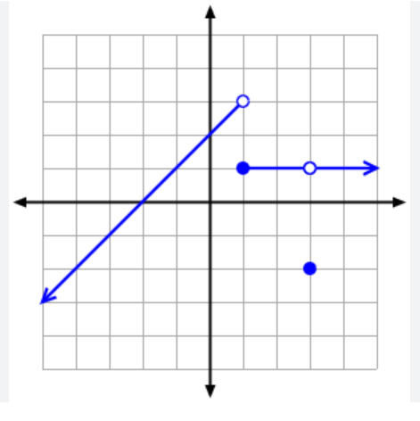

# algoritmi-sd
Repo 2025 per passare il corso di Algoritmi e Strutture Dati del Politecnico di Torino


### QUA SOTTO RIPASSO MARKDOWN

git add .
git commit -m "Messaggio"
git push

### TITOLI E SOTTOTIOLI
**grassetto**
*corsivo*
`codice inline`
~~testo barrato~~


### TESTO E PARAGRAFI
# Capitolo 1 — Strutture Dati
## 1.1 Liste Concatenate
### 1.1.1 Definizione


### ELENCHI PUNTATI
- Primo punto
- Secondo punto
  - Sotto-punto
- Terzo punto

### ELENCHI NUMERATI
1. Primo
2. Secondo
   1. Sottosezione

### PER CODICI
```c #include <stdio.h> int main() { printf("Hello, world!\n"); return 0; } ``` 


### TABELLE
| Struttura | Complessità Inserimento | Complessità Ricerca |
|------------|-------------------------|---------------------|
| Lista      | O(1)                    | O(n)                |
| Albero     | O(log n)                | O(log n)            |
| Tabella    | O(1)                    | O(1)                |


### LINK
[Documentazione Polito](https://didattica.polito.it)

### IMMAGINI


### CITAZIONI
> "La semplicità è la massima sofisticazione."  
> — Leonardo da Vinci

### DIVISORI
---